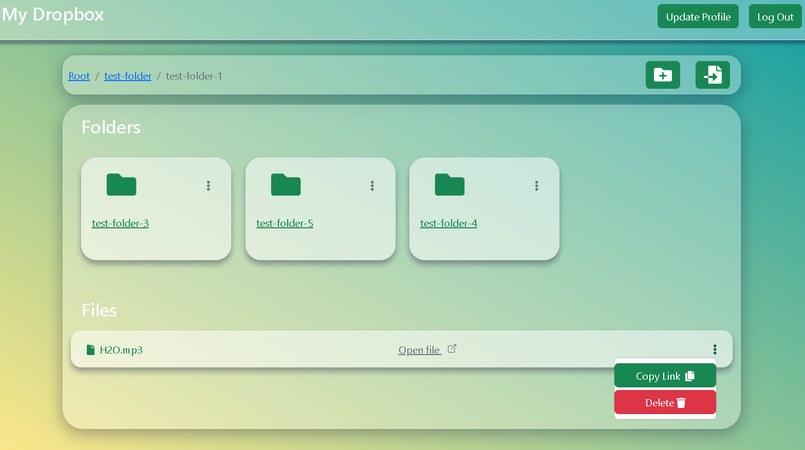

# Welcome to My Dropbox
My Dropbox App

## Task

[Live Demo](https://my-dropbox-tapp.netlify.app)

## Result



## Installation

```
    npm i or npm install
```

## Usage
TechStack

- HTML, CSS
- Bootstrap5
- @fortawesome/fontawesome
- firebase
- React

Features

- create folder
- upload file
- update profile

Update Project Features

- delete folder and file

### The Core Team

- <a href="https://github.com/Oqilbek2121">To'lqinov Oqilbek</a><br>

### My Dropbox Demo Link

```
    https://my-dropbox-tapp.netlify.app
```
